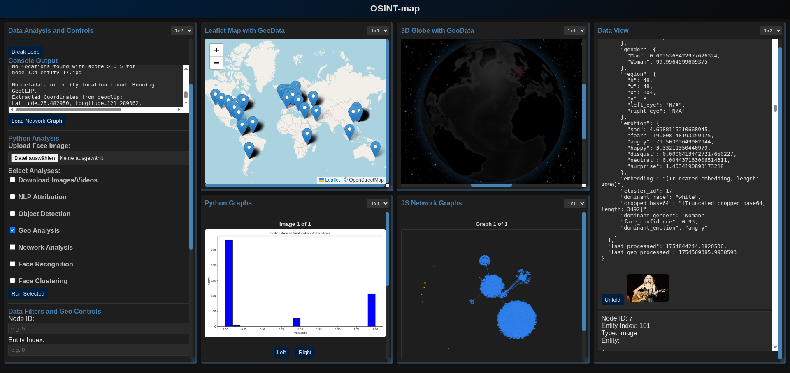

# OSINT-map
OSINT-map is an open-source intelligence (OSINT) tool designed for data scraping, entity extraction, geospatial mapping, and advanced analysis. It integrates web scraping (using Puppeteer), AI-powered entity recognition (via OpenAI/DeepSeek), face recognition/clustering (DeepFace, YOLO), geospatial analysis (GeoCLIP, Nominatim), and network graphing (NetworkX). The frontend features interactive Leaflet maps, 3D globes, and connection graphs for visualizing persons, images, videos, and attributes.



## Key Features
- **Scraping**: Automated browser-based scraping of social media (Instagram, Facebook, Twitter/X, TikTok, Gettr) and general web pages.
- **Entity Extraction**: AI-driven identification of persons, images, videos, and attributes from HTML content.
- **Geo Analysis**: Geocoding locations, extracting metadata from images, and predicting locations with GeoCLIP.
- **Face Recognition/Clustering**: Detect and cluster faces across images/videos using DeepFace and hierarchical clustering.
- **Network Analysis**: Build and analyze connection graphs with centrality measures (betweenness, closeness, etc.).
- **Data Visualization**: Interactive maps, 3D globes, dendrograms, histograms, and word clouds.
- **Database**: PostgreSQL for storing nodes (entities), edges (connections), and content.
- **Backend**: Node.js (Express, WebSocket) for API and real-time updates; Python for heavy analysis.

This tool is ideal for researchers, investigators, or analysts handling OSINT workflows. Built with privacy in mind—runs locally without external cloud dependencies beyond API keys.

## Setup Instructions

### Prerequisites
- **Node.js**: v18+ (with npm)
- **Python**: 3.12+ (with pip)
- **PostgreSQL**: v12+ (running locally on port 5432)
- **API Keys**:
  - OpenAI API key (for entity extraction)
  - DeepSeek API key (alternative AI model)
  - Store in a `.env` file (see below)
- **System Dependencies**: Install `libnss3`, `libatk-bridge2.0-0`, etc., for Puppeteer (on Ubuntu: `sudo apt install -y libnss3 libatk-bridge2.0-0 libdrm-dev libxkbcommon-dev libgbm-dev libasound-dev libatspi2.0-0 libxshmfence-dev`).
- **Browser**: Chromium (auto-installed by Puppeteer).

### Step 1: Clone the Repository
```bash
git clone https://github.com/yourusername/OSINT-map.git # Replace with your repo URL
cd OSINT-map
```

### Step 2: Set Up Environment Variables
Create a `.env` file in the root based on the provided `.env.example`:
```bash
cp .env.example .env
```
Edit `.env` to include your API keys:
```
OPENAI_API_KEY=your_openai_key_here
DEEPSEEK_API_KEY=your_deepseek_key_here
PORT=4000 # Optional: Change if needed
```

### Step 3: Install Node.js Dependencies
```bash
npm install
```
This installs Express, Puppeteer, Multer, OpenAI, etc.

### Step 4: Set Up Python Virtual Environment
```bash
python -m venv myenv
source myenv/bin/activate # On Windows: myenv\Scripts\activate
pip install torch numpy scipy pandas matplotlib ultralytics deepface networkx transformers sentence-transformers geopy pytube validators bs4 scikit-learn datashader geopandas shapely wordcloud piexif psycopg2 pillow opencv-python
```
(Note: Some libraries like `torch` may require CUDA setup for GPU; use CPU by default as per code.)

### Step 5: Download Required Models and Data
- **YOLO Model**: The code downloads `yolov8n.pt` automatically if missing, but you can manually download from: [https://github.com/ultralytics/assets/releases/download/v0.0.0/yolov8n.pt](https://github.com/ultralytics/assets/releases/download/v0.0.0/yolov8n.pt)
- **Geo Data**: Download Natural Earth countries shapefile (~10MB) and extract to `ne_10m_admin_0_countries/`:
```bash
wget https://www.naturalearthdata.com/http//www.naturalearthdata.com/download/10m/cultural/ne_10m_admin_0_countries.zip
unzip ne_10m_admin_0_countries.zip -d ne_10m_admin_0_countries
```

### Step 6: Set Up PostgreSQL Database
- Start PostgreSQL (e.g., `sudo service postgresql start` on Linux).
- Create a database/user (default: user=postgres, password=postgres, db=postgres).
- The app auto-creates tables per project on first run.

### Step 7: Run the Application
- Start the Node.js server:
```bash
node index.mjs # Or index.js if renamed
```
- Access the frontend: Open `http://localhost:4000/map` in your browser.
- For analysis: Use the UI to upload images, select analyses, and run Python via the `/run-python` endpoint.

### Step 8: Usage
- Enter queries in the scraper UI (comma-separated).
- Set recursion depth and hit "Scrape".
- Run analyses like Face Recognition or Geo Analysis via the Python section.
- View results on the map, graphs, and data views.

